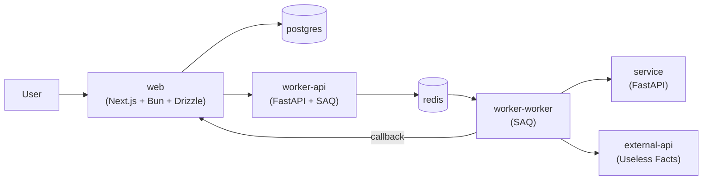

# Open Telemetry Experiment

[](https://github.com/tomdewildt/open-telemetry-experiment/blob/master/LICENSE)

Experiment with [OpenTelemetry](https://opentelemetry.io/) and [SigNoz](https://signoz.io/): a small set of apps that pass a request through several services so the trace/log path can be inspected end-to-end.



Every stage can fail intermittently via its own rate, so there are errors to trace at any point in the path: `NEXT_PUBLIC_WEB_CLIENT_FAILURE_RATE`, `WEB_SERVER_FAILURE_RATE`, `WORKER_API_FAILURE_RATE`, `WORKER_WORKER_FAILURE_RATE`, and `SERVICE_FAILURE_RATE`.

# How To Run

Prerequisites:

* mise version ```2025.1.0``` or later
* docker version ```28.0.0``` or later
* uv version ```0.6.0``` or later
* python version ```3.12.0``` or later
* node version ```24.0.0``` or later
* bun version ```1.3.0``` or later

### Development

1. Run ```mise run init``` to install dependencies.
2. Run ```mise run start``` to start the apps and SigNoz (dev, hot reload).
3. Open [http://localhost:3000](http://localhost:3000) and submit some text. The row moves from `pending` to `done` (or `failed` when a stage injects an error).
4. Open [http://localhost:8080](http://localhost:8080) for the SigNoz UI.

Run ```mise run dev:start``` to start only the apps without SigNoz.

### Production

1. Run ```mise run prod:start``` to start the apps with `ENV=prod`.

### SigNoz

1. Run ```mise run signoz:start``` to start SigNoz (UI at [http://localhost:8080](http://localhost:8080)).
2. Run ```mise run signoz:stop``` to stop SigNoz.
3. Run ```mise run signoz:logs``` to follow the SigNoz logs.

# References

[SigNoz Documentation](https://signoz.io/docs/)

[OpenTelemetry Documentation](https://opentelemetry.io/docs/)

[SAQ Documentation](https://saq-py.readthedocs.io/)

[Drizzle ORM Documentation](https://orm.drizzle.team/)
